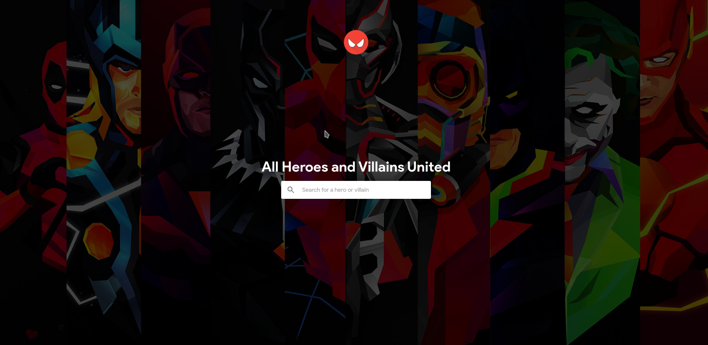

<div align="center">

## shujazz-pwa

</div>

<div align="center">

    Application that allows users to view superheroes information

  [](https://superheroes.herokuapp.com/)

  #### Simple but complicated superheroes

</div>

## Description
This application will be used to view all existing superheroes and villains.

### Application Links

-   Frontend (Superheroes Firebase App Hosting):
    [Superheroes progressive web app]( https://superheroes-7d106.web.app)

### Development set up
1. Install [`Node JS`](https://nodejs.org/en/).
2. To clone, run `git clone https://github.com/mashafrancis/shujaaz-pwa`.
3. `cd` into the root of the **project directory**.
4. Install [`yarn`](https://yarnpkg.com/en/docs/install#mac-stable).
5. Run `yarn install` on the terminal to install dependencies.
6. Create a `.env` file in the root directory of the application. Example of the content of a `.env` file is shown in the `.env.example`
7. Setup local development server.

- In your terminal, execute the following command:
  ```bash
    sudo nano /etc/hosts
  ```
  Otherwise, you can open your hosts file in your editor of choice.
- Add the following line to your `hosts` file:

  ```bash
    127.0.0.1 superheroes.com
  ```

- Save changes and quit the editor.

### Development server

Run `yarn start:dev` for a dev server. Navigate to `http://superheroes:3000/`. The app will automatically reload if you change any of the source files.

### Build

Run `yarn build` to build the project. The build artifacts will be stored in the `dist/` directory. Use the `--prod` flag for a production build.

## Running unit tests

Run `yarn test` to execute the unit tests. This is achieved through the use of jest package which is used to test javascript code .
